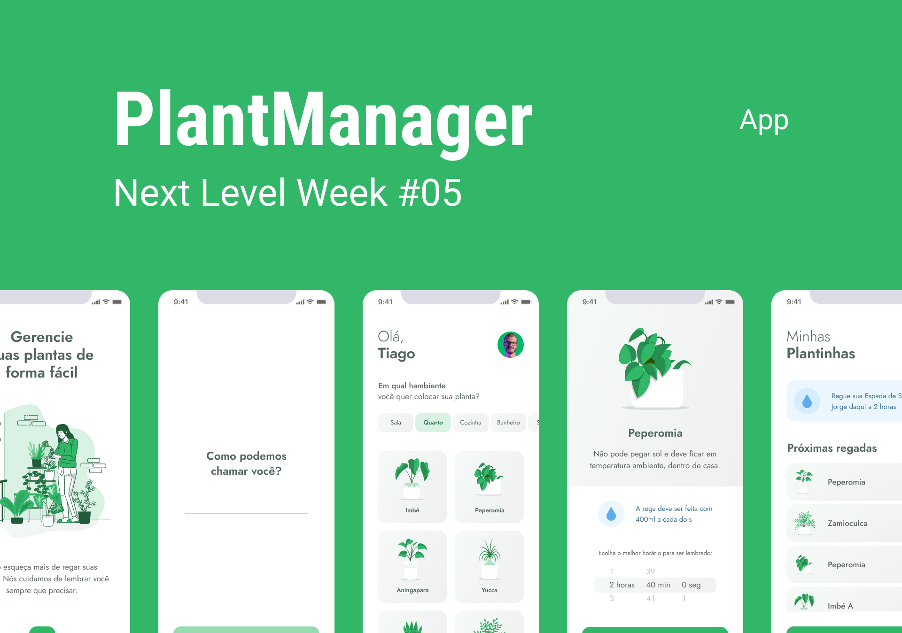

        
    <h1>PlantManager</h1>  
    
🌱 Application to help people take care of their plants.
    
    
    
    

        
        
                        
        
    
     
    

# About

Project created at Next Level Week #5.

 

# Techs

 - [Expo](https://expo.io/)  
 - [React Native](https://reactnative.dev/)
 - [TypeScript](https://www.typescriptlang.org/)

# Requirements

- [Git](https://git-scm.com/) installed
- [Node](https://node.js.org/) installed
- Npm or [Yarn](https://yarnpkg.com/) installed

# Usage

- Run `npm install` or `yarn install`.
- Run `yarn start`

# Authors

- [brunnosena](https://github.com/brunnosena)

 
 
 
 

  <h1>Open Source</h1>
  Copyright © 2021-present, brunnosena.
  
PlantManager <a href="https://github.com/brunnosena/plantmanager/tree/dev/LICENSE">is MIT licensed 💖</a>

  

